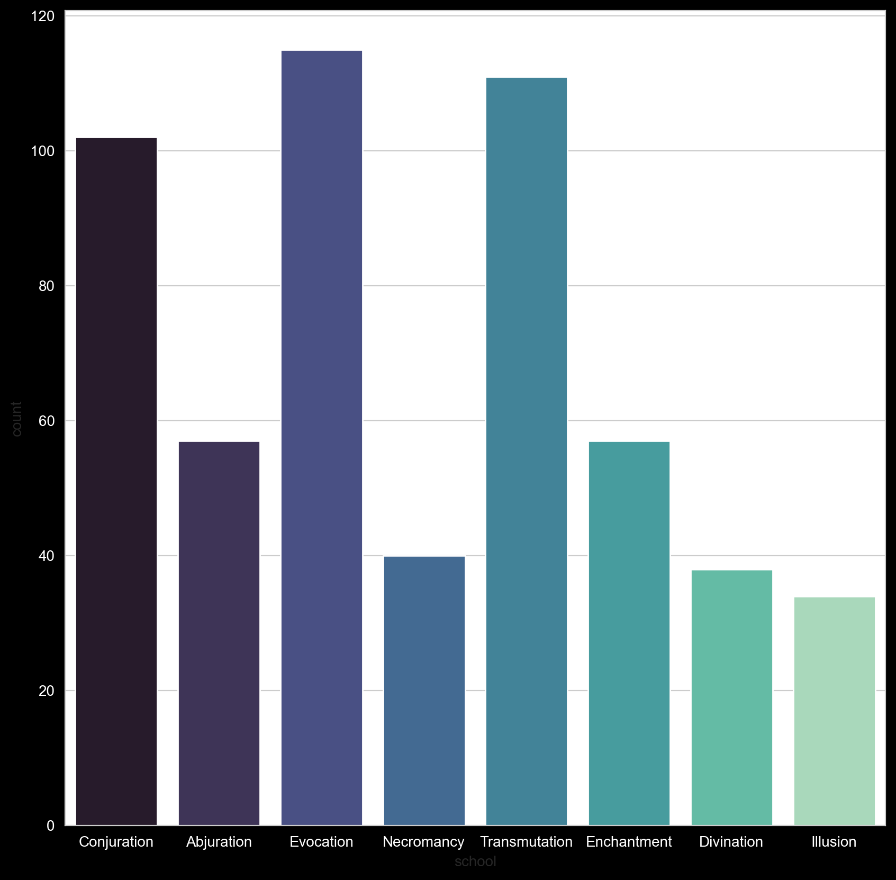

<head>
	<meta http-equiv="Content-Type" content="text/html; charset=utf-8"/>

	<title>Data for Data</title>
	
	
	
</head>
	

<body bgcolor="000000" text="00bfb2">
	<h1> D&D Spell Schools Analysis </h1>
	
 Counts and compares the number of each spell in D&D 5th edition 

	

	
	

	<h2>The codes that generats the visualization</h2>
	<pre><code>
        df = pd.read_csv('dnd-spells.csv', index_col=0)

        plt.rcParams['figure.figsize'] = [10, 10]
        plt.rcParams['figure.dpi'] = 200
        plt.style.use("dark_background")
        sns.set_style('whitegrid')
        p = sns.countplot(x='school', data=df, palette="mako")
        for tick_label in p.get_yticklabels():
        tick_label.set_color("white")
        for tick_label in p.get_xticklabels():
        tick_label.set_color("white")
        p.get_figure().savefig("spells.png",bbox_inches='tight',transparent=False)

	</code></pre>
	
</body>
